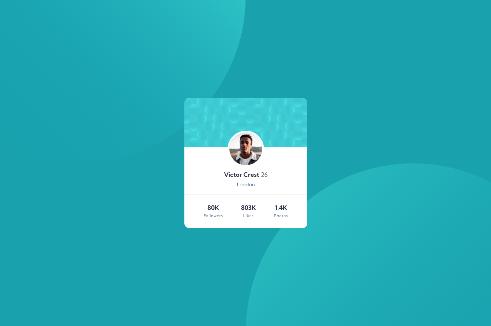

# Frontend Mentor - Profile card component solution

This is a solution to the [Profile card component challenge on Frontend Mentor](https://www.frontendmentor.io/challenges/profile-card-component-cfArpWshJ). Frontend Mentor challenges help you improve your coding skills by building realistic projects.

## Overview

### The challenge

- Build out the project to the designs provided

### Screenshot

### Links

- Solution URL: [Link](https://www.frontendmentor.io/solutions/profile-card-only-html-and-css-mEERcLJrwu)
- Live Site URL: [Link](https://b-viv.github.io/profile_card/)

## My process

### Built with

- Semantic HTML5 markup
- CSS custom properties
- Flexbox

## Author

- Frontend Mentor - [@Viv](https://www.frontendmentor.io/profile/b-viv)
